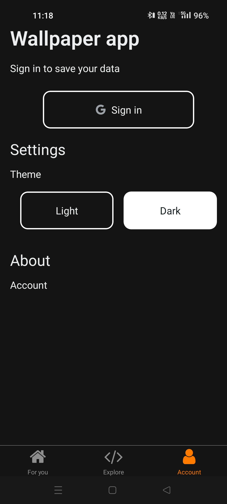

# Welcome to your Expo app 👋

This is an [Expo](https://expo.dev) project created with [`create-expo-app`](https://www.npmjs.com/package/create-expo-app).

## Get started

1. Install dependencies

   ```bash
   npm install
   ```

2. Start the app

   ```bash
    npx expo start
   ```

In the output, you'll find options to open the app in a

- [development build](https://docs.expo.dev/develop/development-builds/introduction/)
- [Android emulator](https://docs.expo.dev/workflow/android-studio-emulator/)
- [iOS simulator](https://docs.expo.dev/workflow/ios-simulator/)
- [Expo Go](https://expo.dev/go), a limited sandbox for trying out app development with Expo

You can start developing by editing the files inside the **app** directory. This project uses [file-based routing](https://docs.expo.dev/router/introduction).

## About Wallpaper app

Simple wallpaper app <b>frontend</b> built using expo, react native.
Following features have been added 
- Bottom bar navigation
- Top bar swipe navigation
- Bottom sheet pull over navigation
- Stack over pop up navigation
- Color theme toggle
- Image download to local device file system

### Screenshots


| Title                                   | Screenshot                                  | Screenshot                                  | Screenshot                                  |
|-----------------------------------------|---------------------------------------------|---------------------------------------------|---------------------------------------------|
| Library, Liked, Suggested sections                         |        |           |     
|  Explore page, BottomSheet on clicking a wallpaper, Downloaded wallpaper |      |       |   
| Account page, Toggle theme, About account pop up  |      |        |    


### References

- [Github repo](https://github.com/hkirat/wallpaper-app/tree/main)
- [Panels app](https://play.google.com/store/apps/details?id=art.panels.wallpapers.playstore&pcampaignid=web_share)

## Get a fresh project

When you're ready, run:

```bash
npm run reset-project
```

This command will move the starter code to the **app-example** directory and create a blank **app** directory where you can start developing.

## Learn more

To learn more about developing your project with Expo, look at the following resources:

- [Expo documentation](https://docs.expo.dev/): Learn fundamentals, or go into advanced topics with our [guides](https://docs.expo.dev/guides).
- [Learn Expo tutorial](https://docs.expo.dev/tutorial/introduction/): Follow a step-by-step tutorial where you'll create a project that runs on Android, iOS, and the web.

## Join the community

Join our community of developers creating universal apps.

- [Expo on GitHub](https://github.com/expo/expo): View our open source platform and contribute.
- [Discord community](https://chat.expo.dev): Chat with Expo users and ask questions.
